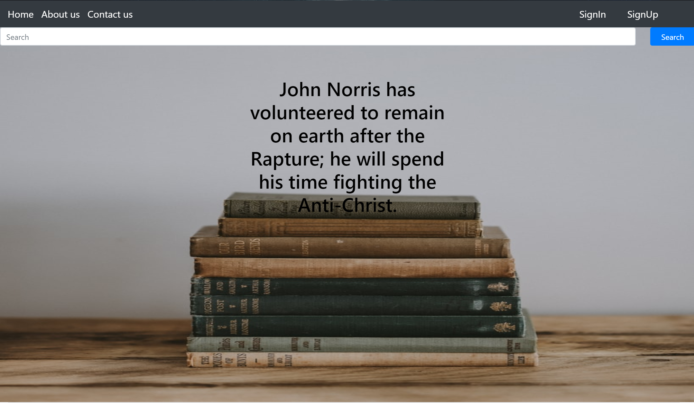
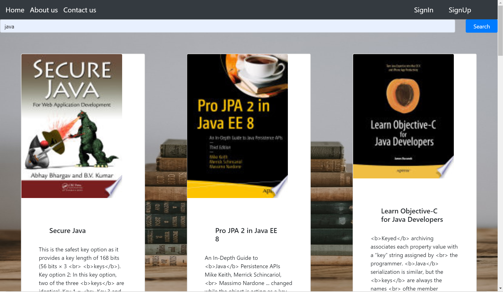
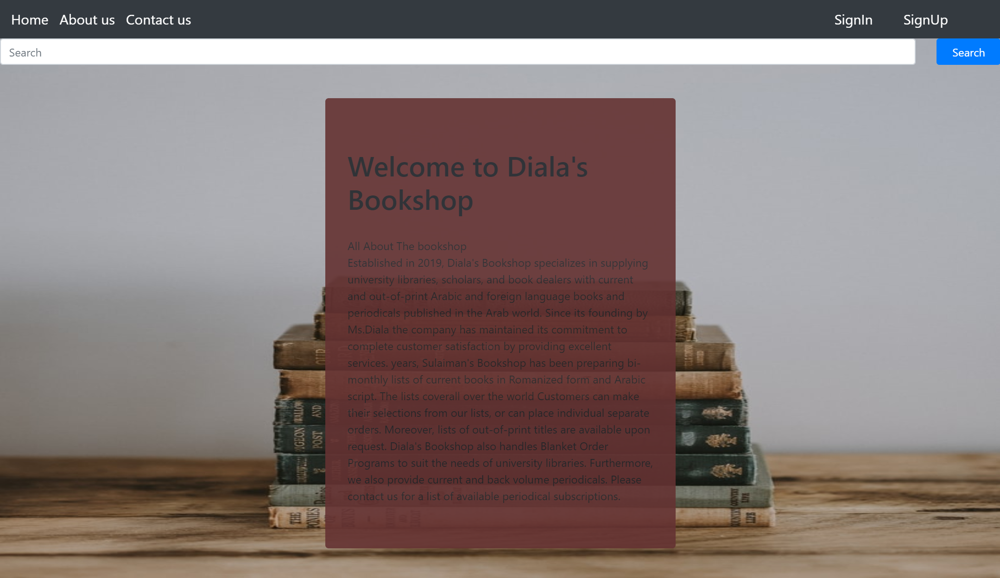

## BookShop
One Paragraph of project description goes here

## Description
A bookshop is a website for books that allows the user to search for books and see it in a PDF and also the user can signin if there is an account, and signup if there is no account .

## Technical Used
- Bootstrap with react
- React 
- Ajax (axios) for API
- React Route-Dom

## Wireframes

## User Stories
 - As a user i would like to search any kind of books.
 - As a user i would like to see a contact us if there is any qusetions.
 - As a user i would like to see a book as PDF.
-  As a user i would like to signin or signup.

## Planning and Development Process

1st day

- I understand th logic of how to develop the website
- Designing the pages using Bootstrap.

2nd day

- I worked on the code step by step .
- I worked on  first API (Books API)

3rd day

- Created the pages.
- Fixed some pugs on the website.
- I workd on the second API (Quotes)

4th day 

- Make the README file 
- Orgnized the code.

## Problem-Solving Strategy
I used a print method to check if the functions is working . 

## Unsolved problems
The propblem with the same API .

## APIs Used
- (https://react-bootstrap.github.io/components/navbar/
)

- (https://react-bootstrap.github.io/components/navs/)
- (https://react-bootstrap.github.io/components/jumbotron/)

## Acknowledgments
I would like to thank my geniuses instructors and classmates for their motivation and providing help.

## References